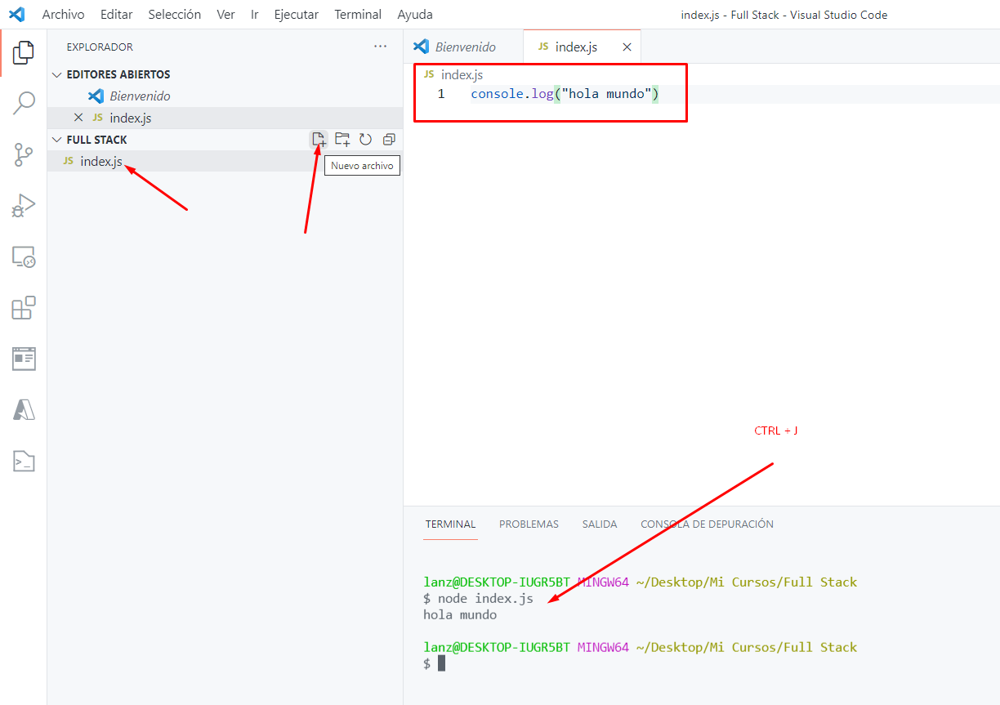

# Instalación de Node JS

Por [Dragón Nómada](https://dragonnomada.medium.com)

## Node JS

> Ingresa a [https://nodejs.org/en/](https://nodejs.org/en/)

> Descarga la versión estable (LTS)

> Ejecuta el instalador

> Marca todas las casillas posibles

> Abre un símbolo del sistema y verifica que la instalación sea correcta

* Usa el comando `node -v`
* Usa el comando `npm -v`
* Usa el comando `npx -v`

## Visual Studio Code

> Ingresa a [https://code.visualstudio.com](https://code.visualstudio.com)

> Abre Visual Studio Code

> Abre una carpeta de trabajo

> Selecciona la carpeta de trabajo

> Crea un archivo `index.js` y ejecútalo

* Crea un nuevo archivo y llamale `index.js`
* Pon el código de `console.log("Hola mundo")`
* Pulsa la tecla `CTRL+J` para abrir la terminal
* Escribe el comando `node index.js`
* Mira el resultado
* Prueba escribir el comando `node .`

